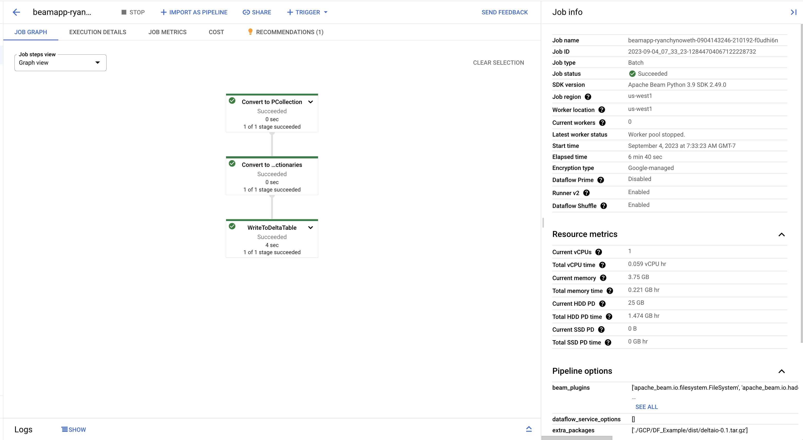

# Dataflow Sample

Dataflow Templates are great. But they are point A to point B "streaming" solutions with a high priority on getting data into BigQuery for analytics. I think of it has an integration tool that ingests data into a batch system (BQ) with little support for ML/AI. In this example, we go beyond the templates and develop a custom job that read/writes data to an from Delta Lake. 


## Setup

1. Create Environment 
    ```
    conda create -n dataflow python=3.9

    conda activate dataflow
    ```

1. [Install the GCP SDK](https://cloud.google.com/sdk/docs/install)
    ```
    # install 
    ./google-cloud-sdk/install.sh

    # auth
    ./google-cloud-sdk/bin/gcloud init
    ```

1. [Install](https://cloud.google.com/sdk/docs/install) and Configure the gcloud CLI then run `gcloud init`. 

1. Might need to run `gcloud auth application-default login` for interactive login. 

1. Run `pip install 'apache-beam[gcp]'`.

1. Run the sample locally with the following from the repository root to test:
    ```
    python -m apache_beam.examples.wordcount --output ./GCP/DF_Example/outputs
    ```

1. Run the sample code remotely with the following from the repository root. Please note that the following command will launch the job on the Dataflow service then save results to an output file (`SomeFile.txt`)
    ```
    python -m apache_beam.examples.wordcount \
        --region us-west1 \
        --input gs://dataflow-samples/shakespeare/kinglear.txt \
        --output gs://racgcs/results/outputs \
        --runner DataflowRunner \
        --project fe-dev-sandbox \
        --temp_location gs://racgcs/tmp/ &> SomeFile.txt  
    ```


1. Now what if I have local code and want to run it locally? 
    ```
    python -m GCP.DF_Example.test_run \ --outputs outputs
    ```

1. Run the local code on the Dataflow Service.  
    ```
    python -m GCP.DF_Example.run_delta \
        --region us-west1 \
        --runner DataflowRunner \
        --project fe-dev-sandbox \
        --temp_location gs://racgcs/tmp/ \
        --requirements_file ./GCP/DF_Example/requirements.txt \
        --extra_package ./GCP/DF_Example/dist/deltaio-0.1.tar.gz
    ```

GCP Dataflow Job that Reads and Writes a Delta Lake Table




### Resources 
- [Python Demo](https://medium.com/google-cloud/understanding-the-dataflow-quickstart-for-python-tutorial-e134f39564c7)
- [Python Quickstart](https://cloud.google.com/dataflow/docs/quickstarts/create-pipeline-python)  
- [SDK](https://cloud.google.com/sdk/docs/install)  
- [YouTube Video](https://www.youtube.com/watch?v=J-b2Eo5Qvp8)
- [Beam Datalake](https://github.com/nanhu-lab/beam-datalake)
- [Delta Lake Documentation](https://delta-io.github.io/delta-rs/python/usage.html#querying-delta-tables)
- [ParquetIO](https://beam.apache.org/releases/pydoc/2.45.0/_modules/apache_beam/io/parquetio.html)
- [BigQueryIO](https://beam.apache.org/releases/pydoc/2.45.0/_modules/apache_beam/io/gcp/bigtableio.html)
- [Creating Jobs from Notebook](https://cloud.google.com/dataflow/docs/guides/interactive-pipeline-development#launch-jobs-from-pipeline)
- [Jobs with Local Dependencies](https://stackoverflow.com/questions/46604870/apache-beam-local-python-dependencies)
- [Beam Local Dependencies](https://beam.apache.org/documentation/sdks/python-pipeline-dependencies/)

Notes:
- GCP Dataflow supports Python 3.5 to 3.9 support 
    - DBR 13.3 LTS is using Python 3.10.6
    - DBR 12.2 LTS is using 3.9.5 
- Define an arrow schema if needed. 
    ```python
    import pyarrow as pa

    data_schema = pa.schema([
                ('product_id', pa.string()),  # Define the schema of the Parquet file
                ('product_category', pa.string()),
                ('product_name', pa.string()),
                ('sales_price', pa.string()),
                ('EAN13', pa.string()),
                ('EAN5', pa.string()),
                ('product_unit', pa.string())
            ])
    ```