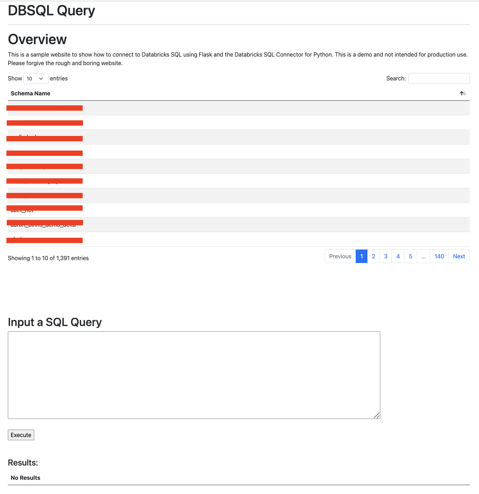

# Databricks Web Application  

Databricks has a [Databricks SQL Connector for Python](https://docs.databricks.com/dev-tools/python-sql-connector.html). The library can connect to both Clusters and SQL Endpoints and is purposed for executing SQL Queries against Databricks compute. 

SQL Endpoints and clusters are not really optimized for web applications as we are an analytics and big data processing compute engine, not a transactional database. However, some customers have wanted to be able to launch SQL queries and use the data in third party applications. One of the use cases I have seen specifically is the ability to update or view data in an application directly from Databricks SQL. These use cases often have lower SLA requirements and users understand that the browser may take a little longer to load than a typical NoSQL database. 

This application allows users to view a list of all the databases in Databricks, submit SQL queries directly against compute, and view the results of the query. 

Disclaimer: This is the first time I have used HTML is a long time so please forgive me for the website itself. 

<br></br>

<br></br>

## Setting the configuration file 

To make it easier for others to run this application, I have a simple configuration file that needs to be created. I would recommend saving this to `app/app_config.conf` and it should run smoothly. 

Here is a simple example:
```
[DEV]
server_hostname=adb-1234567890123456.11.azuredatabricks.net
http_path=/sql/1.0/endpoints/1234567890123456
access_token=123456789012345678901234567890123456
```

Please note the `requirements.txt` file for all dependecies and we are using a Python 3.8 environment.  


## Running the Application Locally 

To run the application locally:
1. Open a command line.  
1. Navigate to the `app` directory.  
1. Run the below commands.  
    ```
    export FLASK_APP=main
    export FLASK_ENV=development
    flask run
    ```
1. Navigate to `127.0.0.1:5000`  


## Docker Commands 

To build and run the docker container run the following commands. 

```
docker image build -t db_web_app . 
docker run -p 5000:5000 -d db_web_app
```

Now navigate to `localhost:5000` in a web browser. Note that the URL may be different depending on where you run the container. In this example, I just run it locally.    